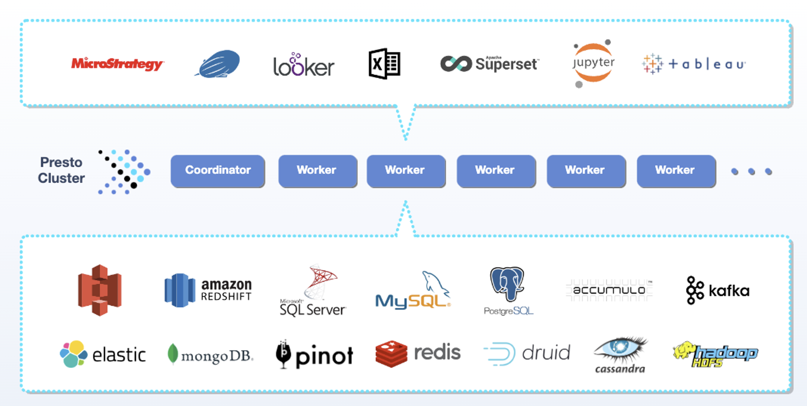

# Introduction

A data lakehouse is a data platform, which merges the best aspects of data warehouses and data lakes into one data
management solution. If you are looking for an open-source solution for data lakehouse, Presto is the perfect choice.
Presto is a fast and reliable SQL query engine for data analytics and the open lakehouse. It can be used in various
use cases, like running interactive/ad hoc queries at sub-second performance for your high-volume apps, or lengthy ETL
jobs that aggregate or join terabytes of data.

Presto is designed to be adaptive, flexible, and extensible. The plugin
mechanism it provides allows you to connect to different data sources. A single Presto query can combine data from
multiple sources, archiving analytics across your entire organization. Dozens of connectors are available from the
Presto community today. You can see the high-level architecture diagram below:

## Features of Presto
Here are the notable features of Presto that make it perfect for the data lakehouse platform.

### Adaptive Multi-tenant System
Presto is capable of running hundreds of concurrent queries and fully utilizing the CPUs, memory, and I/O on the cluster
which can scale up to thousands of worker nodes.

### Extensible
It's easy to set up Presto to connect to many different data sources and run federated queries.

### Performance
Presto is built for high performance. The key features include:
- In-memory data processing and reduce Disk I/O latency.
- Built-in query optimizations, including data layout awareness, predicate pushdown, inter-node parallelism, and etc.
- Optimized stage and task scheduling
- Resource management

## Getting Started
To get set up a Presto cluster and try out its amazing features, you can go to [prestodb.io](https://prestodb.io/) where
you can find the get started information. You can also find detailed documentation [here](https://prestodb.io/docs/current).
In the [Installation](http://prestodb.io/docs/current/installation.html) section, it provides the instructions to set up
simple configurations.

In this workshop, you will use docker to spin up

- A Presto cluster using a coordinator and 3 workers
- A MySQL server with simple data
- A MongoDB with simple data

Without further ado, let's get started.