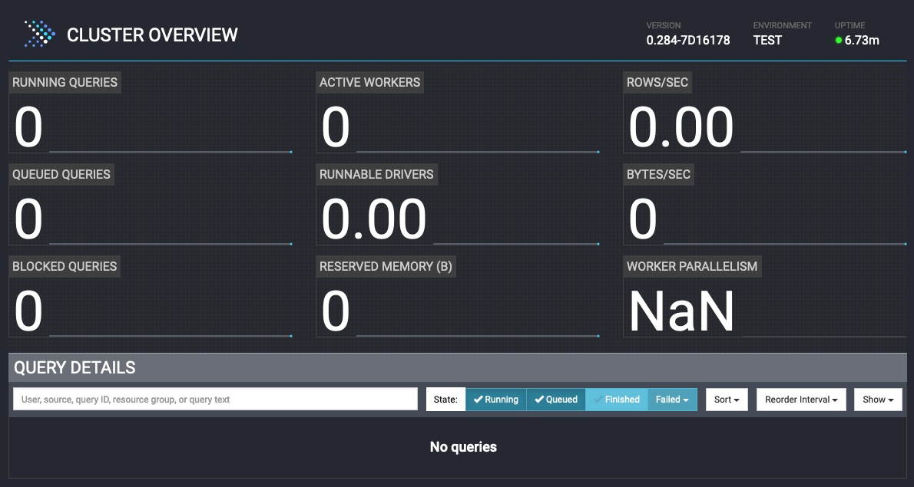
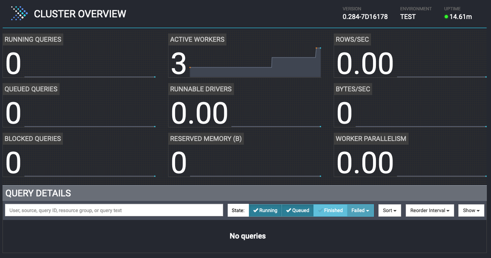

# Set up Presto

In this section, you will:
- Create a docker network to connect all containers that you are going to create
- Set up a Presto cluster including
  - A coordinator node
  - 3 worker nodes

This section is comprised of the following steps:

1. [Create a Presto cluster](#1-create-a-presto-cluster) including:
     - [A coordinator node](#21-presto-coordinator)
     - 3 worker nodes
         - [worker1](#22-worker-node-worker1)
         - [worker2](#23-worker-node-worker2)
         - [worker3](#24-worker-node-worker3)
1. [Check Presto UI](#3-access-the-presto-ui-on-the-coordinator)

## 1. Create a Presto cluster
Run the following command to bring up a Presto cluster which has 1 coordinator node and 3 worker nodes
```sh
docker compose up -d
```
The command pulls the latest `prestodb/presto` image and other images needed in the `./docker-compose.yml` Docker Compose file.

You would see the outputs similar to the following:
```
[+] Running 7/7
 ✔ Container zeppelin      Running                                0.0s
 ✔ Container worker3       Running                                0.0s
 ✔ Container presto-mysql  Running                                0.0s
 ✔ Container worker1       Running                                0.0s
 ✔ Container presto-mongo  Running                                0.0s
 ✔ Container worker2       Running                                0.0s
 ✔ Container coordinator   Running                                0.0s
```

### 2.1 Presto Coordinator
The coordinator is running in a container named `coordinator` using the `prestodb/presto:latest` image with the `config.properties` and `jvm.config` configurations under the `config/coordinator` directory along with the catalog settings in the `./catalog` directory.

Here are the settings for the coordinator:
```text
coordinator=true
node-scheduler.include-coordinator=false
http-server.http.port=8080
discovery-server.enabled=true
discovery.uri=http://localhost:8080
```

- `coordinator` property defines if the Presto server acts as a coordinator or not. Use value `true` for a coordinator.
- `node-scheduler.include-coordinator` property defines if the Presto server acts as a worker as well as a coordinator. Use value `false`
    to not accept worker tasks.
- `http-server.http.port` property defines the port number for the HTTP server.
- `discovery-server.enabled` property defines if the Presto server acts as a discovery server to register workers.
- `discovery.uri` property defines the discovery server's URI which is itself for the coordinator.

You can use the following command to check the logs of the coordinator:
```sh
docker logs coordinator -n 100
```

If the Presto server is up and running properly, the last lines of the outputs would like the following:
```
2023-11-13T23:06:41.958Z        INFO    main    com.facebook.presto.storage.TempStorageManager  -- Loading temp storage local --
2023-11-13T23:06:41.963Z        INFO    main    com.facebook.presto.storage.TempStorageManager  -- Loaded temp storage local --
2023-11-13T23:06:41.989Z        INFO    main    com.facebook.presto.server.PrestoServer ======== SERVER STARTED ========
```

You can check the Presto UI by opening a browser with this URL: [http://localhost:8080](http://localhost:8080)

!!! note
    If you run the lab on a remote server, replace the `localhost` with the server's IP address.
    For example `http://192.168.0.1:8080`

The page would look like this:



### 2.2 Worker Node - worker1
The 1st worker node is named `worker1` and using the configurations under the `conf/worker1` directory with the following settings:

```
coordinator=false
http-server.http.port=8081
discovery.uri=http://coordinator:8080
```

- `coordinator` property is assigned the value of `false` for a worker node.
- `http-server.http.port` property defines the port number for the HTTP server. Since we are running a coordinator and 3 worker nodes on
    the local machine, need to use a different port for each node.
- `discovery.uri` property points to the discovery server on the coordinator.

You can use the following command to check the logs of the first worker node:
```sh
docker logs worker1 -n 100
```

If the worker node is up and running properly, the last lines of the outputs would like the following:
```
2023-11-14T04:03:22.246Z        INFO    main    com.facebook.presto.storage.TempStorageManager  -- Loading temp storage local --
2023-11-14T04:03:22.251Z        INFO    main    com.facebook.presto.storage.TempStorageManager  -- Loaded temp storage local --
2023-11-14T04:03:22.256Z        INFO    main    com.facebook.presto.server.PrestoServer ======== SERVER STARTED ========
```

Check the Presto UI again: [http://localhost:8080](http://localhost:8080). The number of active workers became `1`:

!!! note
    If you run the lab on a remote server, replace the `localhost` with the server's IP address.
    For example `http://192.168.0.1:8080`


### 2.3 Worker Node - worker2
The 2nd worker node is named `worker2` and using the configurations under the `conf/worker2` directory with the following settings:

```
coordinator=false
http-server.http.port=8082
discovery.uri=http://coordinator:8080
```

The settings are almost the same as `worker1, except for the port number:

- `http-server.http.port` property defines the port number for the HTTP server. Since we are running a coordinator and 3 worker nodes on
    the local machine, need to use a different port for each node.


You can use the following command to check the logs of the first worker node:
```sh
docker logs worker2 -n 100
```

Check the Presto UI again: [http://localhost:8080](http://localhost:8080). The number of active workers became `2`:

!!! note
    If you run the lab on a remote server, replace the `localhost` with the server's IP address.
    For example `http://192.168.0.1:8080`


### 2.4 Worker Node - worker3
The 3rd of the worker node is named `worker3` and using the configurations under the `conf/worker3` directory with the following settings:

```
coordinator=false
http-server.http.port=8083
discovery.uri=http://coordinator:8080
```

The settings are almost the same as `worker1` and `worker2`, except the port number:

- `http-server.http.port` property defines the port number for the HTTP server. Since we are running a coordinator and 3 worker nodes on
    the local machine, need to use a different port for each node.


You can use the following command to check the logs of the first worker node:
```sh
docker logs worker3 -n 100
```

## 3. Access the Presto UI on the Coordinator

You have successfully set up a Presto cluster with a coordinator and 3 worker nodes. Check the Presto UI again:
[http://localhost:8080](http://localhost:8080).  The number of active workers became `3`:

!!! note
    If you run the lab on a remote server, replace the `localhost` with the server's IP address.
    For example `http://192.168.0.1:8080`



Well done! Let's move to the next lab to set up data sources.

